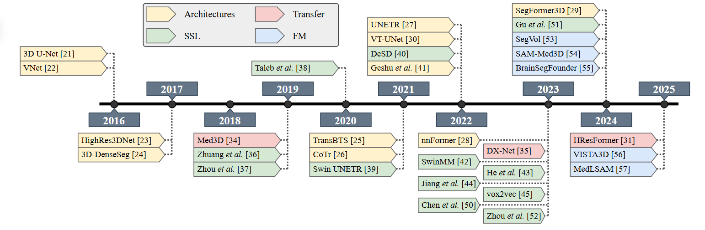

# Strategies for Deep Learning in Volumetric Medical Imaging: A Survey

> This repository gathers the base content used in the tutorial "**Strategies for Deep Learning in Volumetric Medical Imaging: A Survey**".

## Paper
This survey aims to review the main advances in the application of DL to three-dimensional medical data, with an emphasis on the inherent challenges of this domain and emerging strategies to overcome these limitations. 

Authors: João Vitor S. de Oliveira, Danilo F. Vieira, Mateus Pinto da Silva, Daniel L. Fernandes, Marcos H. F. Ribeiro, Hugo N. Oliveira  
Affiliation: Universidade Federal de Viçosa – UFV  
Contact: `joao.silva.oliveira@ufv.br, danilo.f.vieira@ufv.br, mateus.p.silva@ufv.br, daniel.louzada@ufv.br, marcosh.ribeiro@ufv.br, hugo.n.oliveira@ufv.br`

You can access the paper [clicking here!](#) `(available soon)`

## Table of Contents

1. [Architectures](#architectures)
2. [Datasets](#datasets)
3. [Explainability](#explainability)
4. [Foundational](#foundational)

## Graphical Abstract

## Architectures

### Segmentation
| Title | Architecture | Type | Year | Tasks | Link |
|-------|--------------|------|------|--------|------|
| 3D U-Net: Learning Dense Volumetric Segmentation from Sparse Annotation | 3D U-Net | Conv. (Encoder-Decoder) | 2016 | Kidney | [Link](https://arxiv.org/pdf/1606.06650) |
| V-Net: Fully Convolutional Neural Networks for Volumetric Medical Image Segmentation | VNet | Conv. (Encoder-Decoder) | 2016 | Prostate Organ | [Link](https://arxiv.org/pdf/1606.04797) |
| On the Compactness, Efficiency, and Representation of 3D Convolutional Networks: Brain Parcellation as a Pretext Task | HighRes3DNet | Conv. (FCN-like) | 2017 | Brain Parcellation | [Link](https://arxiv.org/pdf/1707.01992) |
| 3D Densely Convolutional Networks for Volumetric Segmentation | 3D-DenseSeg | Conv. (FCN-like) | 2017 | Brain Tissue | [Link](https://arxiv.org/pdf/1709.03199) |
| med3d: transfer learning for 3d medical image analysis | Med3D | Conv. (FCN-like) | 2019 | Brain Tumor, Hippocampus Tissue, Prostate Tissue, Liver Organ, Heart Tissue, Pancreas Organ/Tissue, Vessel Tissue/Tumour, Spleen Organ | [Link](https://arxiv.org/pdf/1904.00625) |
| Efficient 3D Deep Learning Model for Medical Image Semantic Segmentation - ScienceDirect | 3D-DenseUNet-569 | Conv. (Encoder-Decoder) | 2021 | Liver Organ and Tumor | [Link](https://www.sciencedirect.com/science/article/pii/S1110016820305639) |
| RA-UNet: A hybrid deep attention-aware network to extract liver and tumor in CT scans | RA-UNet | Hybrid (UNet Encoder-Decoder with Attention modules on skip connections) | 2018 | Liver Organ and Tumor | [Link](https://arxiv.org/pdf/1811.01328) |
| LCOV-NET: A LIGHTWEIGHT NEURAL NETWORK FOR COVID-19 PNEUMONIA LESION SEGMENTATION FROM 3D CT IMAGES | LCOV-Net | Hybrid (Conv. blocks with Attention and upsample with interpolation without transposed convs) | 2021 | COVID-19 lesions | [Link](https://ieeexplore.ieee.org/stamp/stamp.jsp?tp=&arnumber=9434023) |
| TransBTS: Multimodal Brain Tumor Segmentation Using Transformer | TransBTS | Hybrid (Encoder-Decoder Conv. with Attention in the Bottleneck) | 2021 | Brain Tumor (BraTS) | [Link](https://arxiv.org/pdf/2103.04430) |
| CoTr: Efficiently Bridging CNN and Transformer for 3D Medical Image Segmentation | CoTr | Hybrid (Conv. Encoder, Transf. Encoder, Conv. Decoder) | 2021 | Beyond The Cranial Vault (BTCV) | [Link](https://arxiv.org/pdf/2103.03024) |
| UNETR: Transformers for 3D Medical Image Segmentation | UNETR | Transf. (Encoder-Decoder) | 2022 | Beyond The Cranial Vault (BTCV), Medical Segm. Dec. (MSD) | [Link](https://openaccess.thecvf.com/content/WACV2022/papers/Hatamizadeh_UNETR_Transformers_for_3D_Medical_Image_Segmentation_WACV_2022_paper.pdf) |
| A Robust Volumetric Transformer for Accurate 3D Tumor Segmentation | VT-UNet | Transf. (Encoder-Decoder) | 2022 | Brain Tumor (MSD, BraTS) | [Link](https://arxiv.org/pdf/2111.13300) |
| nnFormer: Interleaved Transformer for Volumetric Segmentation | nnFormer | Transf. (Encoder-Decoder) | 2023 | Brain Tumor (BraTS), Multiorgan Abdominal CT Segmentation (Synapse), Cardiac Cavity Segmentation (ACDC) | [Link](https://d1wqtxts1xzle7.cloudfront.net/116234574/2109-libre.pdf?1718978627=&response-content-disposition=inline%3B+filename%3DnnFormer_Interleaved_Transformer_for_Vol.pdf&Expires=1753120033&Signature=BEKOkpPgatS2yOM5YsL8TEBhaa4oHhZHqnh~-mh5atuUNqpd80cJsED1Pyeh3qf6Xzksz~ZHKeIx85YFiOKWrPln3DamlKF5zWrDBR~US9i7R-kIXNhTnuW6G36PB7oA7aAswIeANLd1O-4mkLdxx3-dYOBR5otu7ik3arWsEhJa6eCjFqr7O29HQrHyktfN9mYnnp~fhElq3K2MjzjJs99sQcSr-ukirKsak5JPSKbtBj0SWDzFdBEg5e7DD1JObLjepwgtKQGpSMuTc6ct8miSJ5Jr7lxoJ~8RJGvmRoejdcZiebUqisTw6Nqat9peNpqyJdJqxnFvV4z9MkGxYA__&Key-Pair-Id=APKAJLOHF5GGSLRBV4ZA) |
| SegFormer3D: An Efficient Transformer for 3D Medical Image Segmentation | SegFormer3D | Transf. (Encoder-Decoder) | 2024 | Brain Tumor (BraTS), Multiorgan Abdominal CT Segmentation (Synapse), Cardiac Cavity Segmentation (ACDC) | [Link](https://openaccess.thecvf.com/content/CVPR2024W/DEF-AI-MIA/papers/Perera_SegFormer3D_An_Efficient_Transformer_for_3D_Medical_Image_Segmentation_CVPRW_2024_paper.pdf) |
| HResFormer: Hybrid Residual Transformer for Volumetric Medical Image Segmentation | HResFormer | Transf. (Encoder-Decoder) | 2025 | Brain Tumor (Bakas et al. 2018), Multiorgan Abdominal CT Segmentation (Synapse), Cardiac Cavity Segmentation (ACDC) | [Link](https://arxiv.org/pdf/2412.11458) |

### Other Tasks
| Title | Architecture | Type | Year | Tasks | Link |
|-------|--------------|------|------|--------|------|
| MedYOLO: A Medical Image Object Detection Framework | MedYOLO | Conv. | 2024 | Detection | [Link](https://pmc.ncbi.nlm.nih.gov/articles/PMC11612059/) |

## Datasets

### Medical Imaging Datasets

| Dataset | Modality | Structures / Tasks | Size | Download Link |
|--------|----------|---------------------|------|----------------|
| **LUNA16** | Thoracic CTs | Lungs | 888 | [TCIA](https://wiki.cancerimagingarchive.net/display/Public/LIDC-IDRI), [LUNA16](https://luna16.grand-challenge.org/Data/) |
| **StructSeg2019 Thorax** | Thoracic CTs | Lungs, Spinal cord, Esophagus, Heart, Trachea | 50 | [Link](https://structseg2019.grand-challenge.org/) |
| **StructSeg2019 Head and Neck** | Head and Neck CTs | Multiple organs (22 classes) | 50 | [Link](https://structseg2019.grand-challenge.org/) |
| **OSIC** | Thoracic CTs | Lungs | 99 (after filtering) | [Kaggle](https://www.kaggle.com/c/osic-pulmonary-fibrosis-progression) |
| **CHAOS Challenge** | Abdominal CTs, T1-DUAL & T2-SPIR MRIs | Liver, Kidneys, Spleen | 40 CTs + 120 MRIs | [CHAOS](https://chaos.grand-challenge.org/Download/), [Zenodo](https://zenodo.org/record/3431873#.X7IPsJ1KiV4) |
| **Multi-organ Abdominal CT** | Abdominal CTs | Spleen, Right kidney (BTCV), Left kidney, Gallbladder, Esophagus, Liver, Stomach, Aorta (BTCV), Inferior vena cava (BTCV), Portal vein and splenic vein (BTCV), Pancreas, Right adrenal gland (BTCV), Left adrenal gland (BTCV), Duodenum | 90 | [Zenodo](https://zenodo.org/record/1169361#.X7IOsZ1KiV4) |
| **Decathlon Liver** | Abdominal CTs | Liver, Tumors | 63 (train) + 32 (test) | [Link](http://medicaldecathlon.com/) |
| **Decathlon Spleen** | Abdominal CTs | Spleen | 41 (train) + 20 (test) | [Link](http://medicaldecathlon.com/) |
| **Decathlon Pancreas** | Abdominal CTs | Pancreas | 282 (train) + 139 (test) | [Link](http://medicaldecathlon.com/) |
| **Decathlon Heart** | Cardiac MRI | Heart | 20 (train) + 10 (test) | [Link](http://medicaldecathlon.com/) |
| **LiTS** | Abdominal CTs | Liver, Lesions | 130 | [Codalab](https://competitions.codalab.org/competitions/17094#participate) |
| **QUBIQ Pancreas** | Abdominal CTs | Pancreas | 58 | [Link](https://qubiq21.grand-challenge.org/) |
| **KiTS21** | Abdominal CTs | Kidney, Tumors | 300 | [Challenge](https://kits21.grand-challenge.org/), [GitHub](https://github.com/neheller/kits21) |
| **COVID-19 Lung Segmentation** | Thoracic CTs | Lungs | 20 | [Zenodo](https://zenodo.org/record/3757476#.YSJtgJpKiV4) |
| **PROMISE12** | T2W Prostate MRI | Prostate | 50 | [Link](https://promise12.grand-challenge.org/) |
| **FeTA** | T2W Brain MRI | Brain tissues (7 classes) | 80 | [Link](https://feta-2021.grand-challenge.org/Home/) |
| **CTPEL** | Pelvis CTs | - | 90 | [Link](https://datahub.aida.scilifelab.se/10.23698/aida/ctpel) |
| **VESSEL12** | Thoracic CTs | Lungs | 23 | [Kaggle](https://www.kaggle.com/andrewmvd/lung-vessel-segmentation) |
| **T2w Kidney MRI** | T2W MRI | Kidney | 100 | [Zenodo](https://zenodo.org/record/5153568) |
| **Hippocampus Segmentation (DRYAD)** | T1W & T2W | Hippocampus | 25 | [Zenodo](https://zenodo.org/record/4934690) |
| **OpenMind SSL** | MRI | Head and Neck | 114,000 | [ArXiv](https://arxiv.org/abs/2412.17041) |
| **KiTS2023** | CT | Kidney, Renal Tumors, Cysts | 489 (train) + 110 (test) | [Challenge](https://kits-challenge.org/kits23/) |
| **FLARE 2023** | CT | 13 abdominal organs + tumor | 2200 (train) + 100 (val) + 400 (test) | [ArXiv](https://arxiv.org/abs/2408.12534) |
| **BraTS2024** | mpMRI | Brain Gliomas | 2200 | [ArXiv](https://arxiv.org/abs/2405.18368) |
| **OrganMNIST3D** | CT | Abdominal | 1742 | [MedMNIST](https://medmnist.com/) |
| **NoduleMNIST3D** | CT | Chest | 1633 | [MedMNIST](https://medmnist.com/) |
| **AdrenalMNIST3D** | CT | Abdominal | 1584 | [MedMNIST](https://medmnist.com/) |
| **FractureMNIST3D** | CT | Chest | 137 | [MedMNIST](https://medmnist.com/) |
| **VesselMNIST3D** | MRA | Brain | 1908 | [MedMNIST](https://medmnist.com/) |
| **SynapseMNIST3D** | Electron Microscopy | - | 1759 | [MedMNIST](https://medmnist.com/) |

## Explainability
| Tecnique Type              | Method                                     | Link |
|----------------------------|--------------------------------------------|------|
| Gradient-Based Methods     | CAM (Class Activation Mapping)             | [Link](https://openaccess.thecvf.com/content_cvpr_2016/papers/Zhou_Learning_Deep_Features_CVPR_2016_paper.pdf) |
| Gradient-Based Methods     | Grad-CAM (Gradient-weighted Class Activation Mapping) | [Link](https://arxiv.org/abs/1611.07450) |
| Gradient-Based Methods     | Grad-CAM++ (Gradient-weighted Class Activation Mapping++) | [Link](https://ieeexplore.ieee.org/abstract/document/8354201?casa_token=RcVqWxhdj6YAAAAA:ZjG8XTOLdEBBRFUGxZ87Mn5_sr5_fxdcSkChfyFkWC-BwC4g3tcJjKTBj6u5mjTMFGZQn5V9gg) |
| Gradient-Based Methods     | Guided Backpropagation                     | [Link](https://arxiv.org/abs/1412.6806) |
| Perturbation-Based Methods | LIME (Local Interpretable Model-agnostic Explanations) | [Link](https://dl.acm.org/doi/abs/10.1145/2939672.2939778) |
| Perturbation-Based Methods | Occlusion                                  | [Link](https://www.cell.com/fulltext/S0092-8674(18)30154-5) |
| Perturbation-Based Methods | Integrated Gradients                       | [Link](https://www.sciencedirect.com/science/article/pii/S0161642018315756) |
| Perturbation-Based Methods | SHAP (SHapley Additive exPlanations)       | [Link](https://proceedings.neurips.cc/paper_files/paper/2017/file/8a20a8621978632d76c43dfd28b67767-Paper.pdf) |
| Decomposition-Based Methods| LRP (Layer-wise Relevance Propagation)     | [Link](https://journals.plos.org/plosone/article?id=10.1371/journal.pone.0130140) |
| Perturbation-Based Methods | TCAV (Testing with Concept Activation Vectors) | [Link](https://proceedings.mlr.press/v80/kim18d/kim18d.pdf) |

## Foundational
### Segmentation
| Title | Method | Year | Link |
|-------|--------|-----|------|
| VISTA3D: A Unified Segmentation Foundation Model For 3D Medical Imaging | VISTA3D | 2025 | [Link](https://openaccess.thecvf.com/content/CVPR2025/papers/He_VISTA3D_A_Unified_Segmentation_Foundation_Model_For_3D_Medical_Imaging_CVPR_2025_paper.pdf) |
| SAM-Med3D: Towards General-purpose Segmentation Models for Volumetric Medical Images | SAM-Med3D | 2023 | [Link](https://arxiv.org/pdf/2310.15161) |
| BrainSegFounder: Towards 3D foundation models for neuroimage segmentation - ScienceDirect | BrainSegFounder | 2024 | [Link](https://www.sciencedirect.com/science/article/pii/S1361841524002263) |
| WeakMedSAM: Weakly-Supervised Medical Image Segmentation via SAM With Sub-Class Exploration and Prompt Affinity Mining | WeakMedSAM | 2025 | [Link](https://www.webofscience.com/wos/woscc/full-record/WOS:001523480800030?AlertId=bd1375a1-bd11-4f92-93c0-44498427633f) |
| MedLSAM: Localize and segment anything model for 3D CT images - ScienceDirect | MedLSAM | 2025 | [Link](https://www.sciencedirect.com/science/article/abs/pii/S1361841524002950) |
